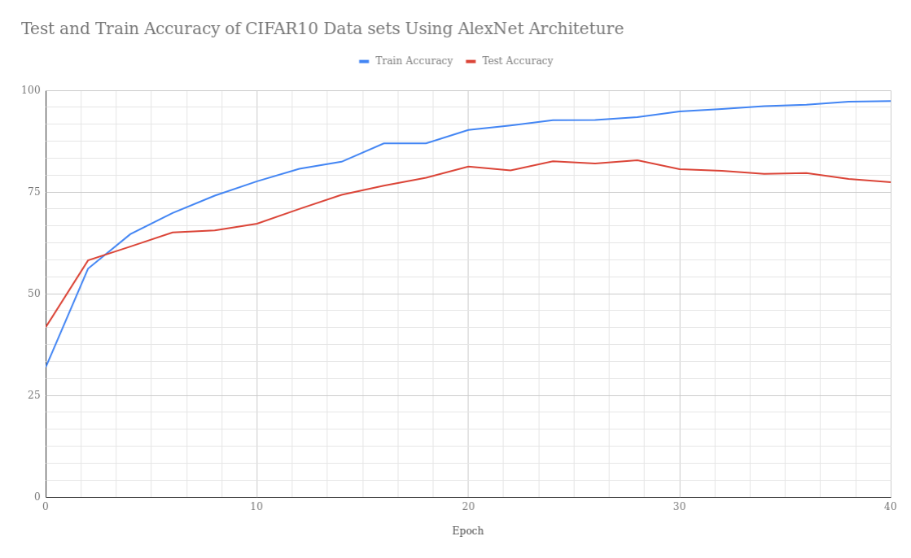

# Assignment 4 Report

## This is Test and Accuracy Table for CIFAR10 Classification using VGG16 

| Epochs |Train Accuracy  | Test Accuracy|
|--|--|--|
0	|   42.59	|  59.66
2	|   75.93	|  77.16
4	|   84.3	|  81.3
6	|   89.19	|  82.58
8	|   93.62	|  84.92
10	|   	|  
12	|   	|  
14	|   	|  
16	|   	|  
18	|   	|  
20	|   	|  

 

## This is Test and Accuracy Table for CIFAR10 Classification using AlexNet 

| Epochs |Train Accuracy  | Test Accuracy|
|--|--|--|
0	|   31.96	|  41.8
2	|   56.17	|  58.2
4	|   64.64	|  61.6
6	|   69.84	|  65.05
8	|   74.11	|  65.58
10	|   77.65	|  67.21
12	|   80.72	|  70.85
14	|   82.45	|  74.32
16	|   86.95	|  76.58
18	|   86.99	|  78.52
20	|   90.25	|  81.25
22	|   91.37	|  80.32
24	|   92.64	|  82.56
26	|   92.73	|  82
28	|   93.4 	|  82.82
30	|   94.8 	|  80.64
32	|   95.41	|  80.2
34	|   96.1 	|  79.45
36	|   96.47	|  79.65
38	|   97.2 	|  78.2
40	|   97.35	|  77.4

 
